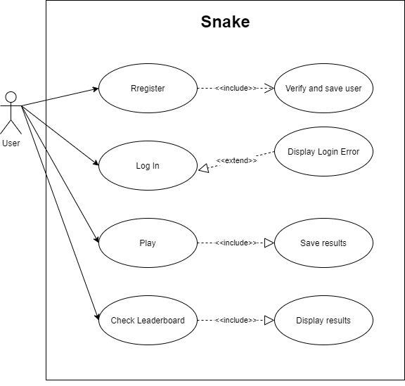

# A rendszer célja
A rendszer célja a szórakoztatás, amelyet egy JavaScriptben írt kígyó fog elvégezni. A játék viszonylag egyszerű felépítésű, egy pályán a kígyót irányítva, almákat felvéve a kígyó méretét és pontszámot növelve kell minnél tovább életben maradni. A kigyó irányítása a billenytyűzeten lévő nyilak segítségével hajtható végre. A pályán néhány akadály is található amelyhez hozzáérve a játék véget ér. A játék akkor is véget ér ha a kígyó feje hozza ér a teste bármelyik részéhez.
# Projekt terv
Megrendelő: QNSZT kft.
Projekt vezetők: Farkas Balázs, Tóth Noémi, Barkóczi Martin
A projektvezető felelős a projektcélok megvalósulásáért. A projektvezető ritkán vesz részt közvetlenül a projekt végeredményének előállításához szükséges
tevékenységekben, viszont biztosítja a folyamatos előrehaladást, és a különböző résztvevők közötti kölcsönösen hatékony együttműködést annak érdekében,
hogy a projekt sikeres legyen.
Junior programozók: Alexa Kornél, Horvát István, Horváth Gábor
A Junior programozó feladata számítógépes szoftverek (programok) megtervezése és kivitelezése.
A rendszer elkészítésére 1 hónap áll rendelkezésre. Ez idő alatt a dokumentációnak és a rendszernek is kész kell hogy legyen.
## Ütemterv:

|Funkció               | Feladat                                          | Prioritás |	Becslés | Határidő |
|:--------------------:|:------------------------------------------------:|:---------:|:-------:|:-----------:|
|Pálya                 | Pálya megtervezése                               | A         | 12 óra  | 2020.10.05. |
|Irányítás             | Irányítás megtervezése és megvalósítása          | A         | 24 óra  | 2020.10.06. |
|Pontozási rendszer    | Pontozási rendszer megtervezése és megvalósítása | B         | 12 óra  | 2020.10.07. |
|Random pont generálás | Random pont generálása képernyőre                | A         |	6 óra   | 2020.10.07. |
|Növekedés             | Növekedés megvalósítása                          | C         | 12 óra  | 2020.10.07. |
|Timer                 | Timer implementálása                             | B         | 6 óra   | 2020.10.07. |

A: Nagyon fontos
B: Fontos
C: Kevésbé fontos
- Dokumentációnak 2020 október 1-re kész kell lennie.
- A rendszerhez szükséges pályának 2020 október  5-re kész kell lennie.
- A rendszerhez szükséges irányításnak 2020 október  6-re kész kell lennie.
- A rendszerhez szükséges játék 2020 október  7-re kész kell lennie.

## Mérföldkövek:
- Rendszer főbb részeinek megtervezése.
- Rendszer megvalósítása a tervek alapján.
- Dokumentáció megírása.
- Tesztelés/Javítás.

# Üzleti folyamatok modellje

# Követelmények
Fontos lenne, ha a rendszer tartalmazna igényesen elkészitett Grafikai elemeket mivel ez nagyban hozzajárul a felhasználói élményhez. Ezentúl jó lenne, ha a rendszer tartalmazna megfelelően elkészített Pontrendszert is ahol megnézhetnénk az előző körökben elért eredményt és azt is, hogy mennyi volt a legjobb elért pontszám. Legyen a rendszerben egy igényesen elkészített Menü is amelyben kényelmesen lehet navigálni, például játék indítására, pontszámok megtekintésére, esetleg nehézségi szint választására és egy kilépés opcióra.
- Pálya megtervezése
- Pontozási rendszer létrehozása
- Random pont generálása képrenyőre
- Mozgatás és Növekedés implementálása

# Funkcionális terv

## Rendszerszereplők:
Admin
Játékosok

## Rendszer használati esetek és lefutásaik:
	
### Admin:
- Beléphet bármelyik szereplőként és teljes hozzáférése van a rendszerhez
- A felhasználói adatokat látják, megváltoztathatják
- Felhasználók hozzáadásához, töléséhez van lehetősége
- Adatbázis megtekintése
- Alkalmazás elindítása
- Saját adataikat tudják változtatni
	
### Játékosok:
- Képes az alkalmazás elindítására
- Az adatbázis megtekintésére
- Saját adatai változtatására
- Alkalmazáson belüli beállítások változtatására

## Menü-hierarchiák:

### Bejelentkezés:
- Bejelentkezés
- Regisztráció
- Segítség

### Main menü:
- Játék elindítása
- Felhasználók megtekintése(Admin)
- Adatbázis megtekintése
- Előző eredmények megtekintése
- Személyes adatok
- Kijelentkezés

# Fizikai környezet
A megrendelő által kért Snake játékot a JavaScriptben fogjuk kivitelezni, Visual Studio Code program használatba vételével.
A fejlesztések Windows 10 operációs rendszeren végezzük, azonban a program több operációs rendszeren is futni fog.
- JavaScript 1.8.5
- Visual Studio Code 1.49.0
A webalkalmazásnak megfelelően kell működnie és megjelennie a következő böngészőverziókban:
- Microsoft Edge
- Mozilla Firefox
- Apple Safari
- Google Chrome
- Opera

# Tesztterv
Alkalmazásunkat minden böngészőben teszteljük 800 × 600, 1024 × 768, 1360 × 768 és 1920 × 1080 képernyőfelbontásokkal, illetve ellenőrizzük, hogy futás közben ne fordulhassanak elő váratlan hibaesetek. Ezen felül ellenőrizzük, hogy csak az előre megadott gombokkal lehessen csak irányítani a játékot.